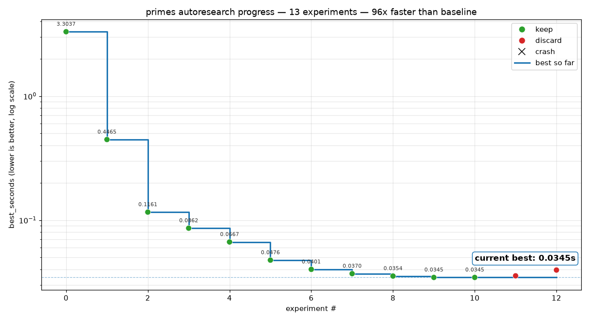

# autoprime

**A self-driving research loop that discovers and accelerates prime-generation algorithms — on its own.**

autoprime is an [autoresearch](https://github.com/karpathy/autoresearch)-style experiment: you give an LLM a problem, a tamper-proof benchmark, and one file it's allowed to edit — then it does the research. It hypothesizes an optimization, implements it, benchmarks it, and keeps it only if the output is _provably correct AND faster_, then repeats, unsupervised. No human tuning the algorithm.

We pointed it at one concrete task — **generate all prime numbers ≤ n as fast as possible in Python** (standard library + numpy only) — but the loop is the point. The prime task is just a clean, verifiable testbed.

## Why fast prime-finding matters

Primes are the atoms of number theory, and finding them quickly is a bottleneck everywhere. Cryptography runs on primes — RSA, Diffie-Hellman, and nearly every TLS handshake, certificate, and signature depend on generating and testing them at massive scale. Research sieves ever-larger ranges to test conjectures, and the hunt for record-breaking primes is fundamentally a race for faster algorithms. It's a primitive executed billions of times a day, so every constant factor shaved off pays back everywhere — the gap between instant and infeasible.

## The loop

The value isn't any single sieve — it's the autonomous research cycle that finds them:

1. **Hypothesize** — propose an algorithmic idea (a new sieve, wheel factorization, segmentation, vectorization, parallelism…)
2. **Implement** — edit `primes.py`, the one file the loop is allowed to touch
3. **Benchmark** — a fixed, read-only harness times the code and verifies every prime is correct
4. **Select** — faster? keep the commit. Slower or wrong? revert.
5. **Repeat** — indefinitely, logging every experiment

Correctness is the one hard gate. `evaluate.py` times `primes(n)` over 3 runs, takes the best, and checks the output is _exactly_ the set of primes ≤ n — nothing missing, no composites, sorted, no duplicates — against an independent reference sieve. A wrong answer scores nothing, so the search can only ever move toward code that is both correct and faster.

## Results

Starting from a naive baseline, the loop evolved the algorithm entirely on its own:

| Idea                                                | best_seconds |
| --------------------------------------------------- | -----------: |
| baseline: bytearray Sieve of Eratosthenes           |        3.304 |
| odd-only numpy sieve, vectorized striding           |        0.446 |
| segmented sieve for cache locality                  |        0.116 |
| interleaved mod-6 wheel (self-sorting, 1/3 density) |        0.086 |
| preallocated output + in-place arithmetic           |        0.067 |
| multithreaded segments (numpy releases the GIL)     |        0.048 |
| reused thread pool + load-balanced segments         |        0.040 |
| two-phase parallel write, reusable buffers          |        0.035 |

**3.30s → 0.035s at n = 10⁸ — roughly a 95× speedup**, with peak memory flat (~330 MB). Full log in `results.tsv`.



> Absolute times are hardware-dependent; different machines will see different numbers but the same relative progression. Timings are only comparable at the same `n`.

## Verify it yourself

```
uv run evaluate.py              # default n = 10^8
uv run evaluate.py --n 1e7      # smaller n for a quick check
```

Each step is a git commit on the `autoresearch/*` branch plus a row in `results.tsv`, so the whole research history is reproducible — check out any commit and re-run the harness.

## Layout

- `program.md` — the research protocol the agent follows (setup, experiment loop, logging rules)
- `primes.py` — the single file the loop evolves; defines `primes(n)` returning all primes ≤ n in increasing order
- `evaluate.py` — the fixed, read-only judge: timing + correctness verification + peak memory
- `results.tsv` — the full experiment log, one row per idea tried
- `progress.png` — runtime dropping across experiments

## Rules

Python standard library + numpy only. No sympy, no primesieve, no compiled extensions. The evaluation harness is read-only. `n` stays fixed across a run.
